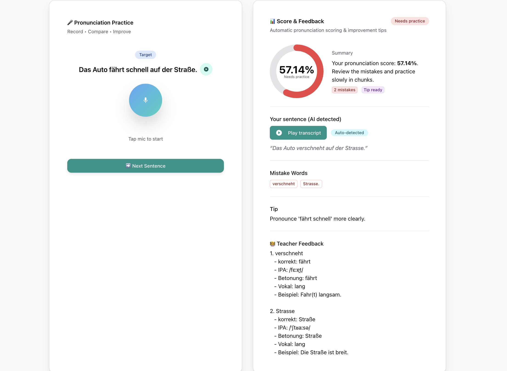

# 🗣️ German Speech Recognition & Pronunciation Evaluation AI

## Overview

This project provides a full-stack solution for German language pronunciation practice, featuring:
- A **Flask backend API** for automatic speech recognition (ASR) and pronunciation evaluation.
- A **Next.js frontend** for interactive practice, instant feedback, and AI-powered teacher tips.

It uses state-of-the-art AI models (Whisper, Azure OpenAI) to transcribe spoken German, score pronunciation, highlight mistakes, and provide actionable feedback.

---

## Features
- 🎤 Record and transcribe German speech audio (webm format supported)
- 📝 Compare spoken text to a reference sentence
- 📊 Get pronunciation score, word error rate (WER), character error rate (CER)
- ❌ Identify mispronounced or missing words, with suggestions and tips
- 👩‍🏫 Receive AI-powered teacher feedback (phonetics, IPA, stress, examples)
- 🌙 Modern, responsive UI (Chakra UI, Next.js)

---

## Demo Screenshots



---

## Architecture

- **Backend:** Python, Flask, Whisper (Hugging Face), jiwer, soundfile, ffmpeg
- **Frontend:** Next.js 15.4.6, React, Chakra UI, TypeScript
- **AI Feedback:** Azure OpenAI GPT (for teacher feedback)

---

## Getting Started

### 1. Backend Setup (Flask)

Clone the repository and install dependencies:
```bash
git clone https://github.com/your-username/german-speech-ai.git
cd german-speech-ai
python -m venv .venv
source .venv/bin/activate   # On Linux/Mac
.venv\Scripts\activate      # On Windows
pip install -r requirements.txt
```

Start the Flask API server:
```bash
python app.py
```
The server will run on http://localhost:8000

### 2. Frontend Setup (Next.js)

Go to the frontend directory and install dependencies:
```bash
cd frontend
npm install
# or
yarn install
```

Create a `.env.local` file in the `frontend/` directory with your Azure OpenAI credentials:
```
AZURE_OPENAI_API_KEY=your-key-here
AZURE_OPENAI_ENDPOINT=https://your-resource.openai.azure.com/
AZURE_OPENAI_DEPLOYMENT_NAME=your-deployment
AZURE_OPENAI_API_VERSION=2024-02-15-preview
```

Start the development server:
```bash
npm run dev
# or
yarn dev
```
Open [http://localhost:3000](http://localhost:3000) in your browser.

> **Note:** The backend API (Flask, port 8000) must be running for evaluation to work.

---

## API Reference

### POST `/api/evaluate`
- **Description:** Transcribes uploaded German speech and evaluates pronunciation against a reference sentence.
- **Request:**
  - `audio`: Audio file in webm format (multipart/form-data)
  - `target_text`: Reference German sentence (string)
- **Response:** JSON with transcription, score, mistakes, and tips.

### GET `/api/hello`
- **Description:** Health check endpoint.
- **Response:** `{ "message": "Hello from Flask API!" }`

---

## requirements.txt

```
flask
flask-cors
transformers==4.55.2
torch==2.8.0
soundfile
jiwer
huggingface_hub
```

---

## Notes
- ffmpeg must be installed and available in your system PATH for audio conversion.
- The first run will download the Whisper model (may take several minutes).
- For production, consider using a WSGI server (e.g., gunicorn) and proper CORS settings.

---

## License

MIT License © 2025
