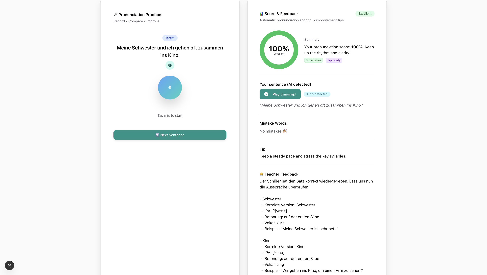
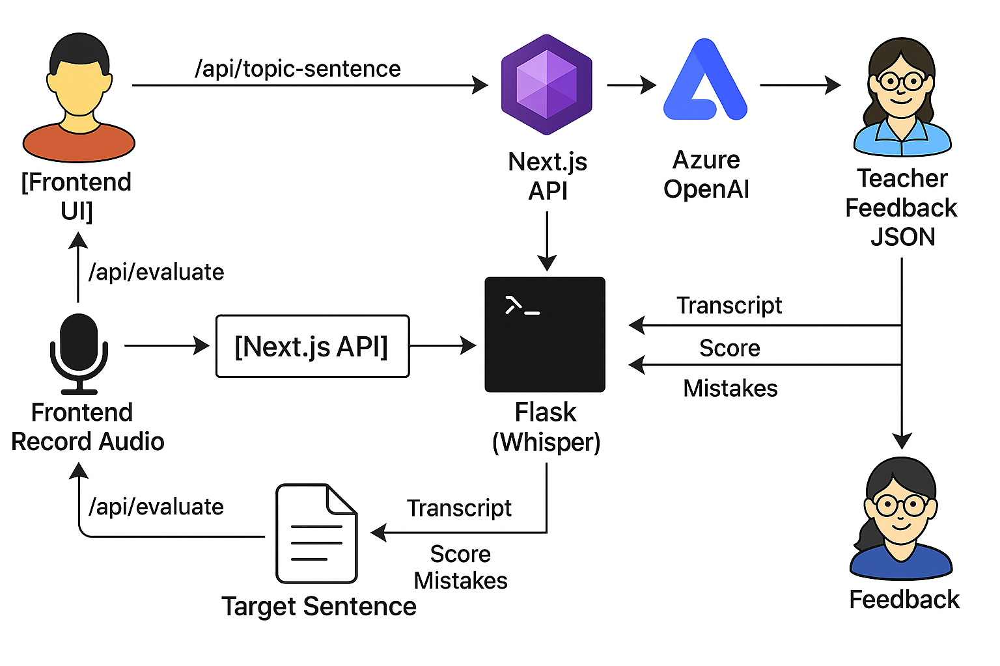
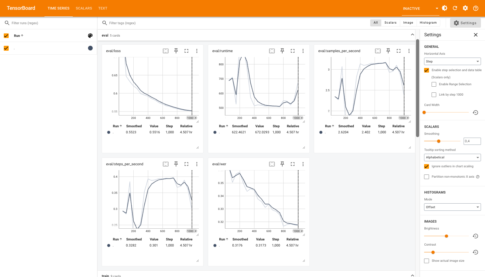
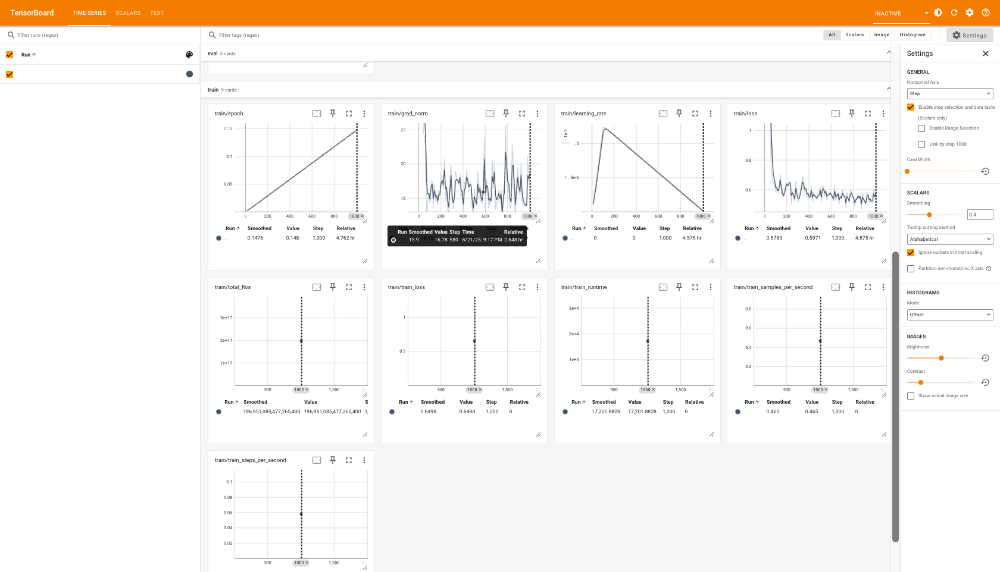

# 🗣️ German Speech Recognition & Pronunciation Evaluation AI

## Overview
This project provides a **full-stack solution** for German pronunciation practice.  
It combines **Automatic Speech Recognition (ASR)** using Whisper, **pronunciation scoring** (WER/CER), and **AI teacher feedback** powered by Azure OpenAI.

---

## ✨ Features
- 🎤 Record and transcribe German speech audio (`.webm` supported)
- 📝 Compare spoken text to a reference sentence
- 📊 Pronunciation score + **Word Error Rate (WER)** and **Character Error Rate (CER)**
- ❌ Identify mispronounced or missing words, with suggestions
- 👩‍🏫 AI-powered teacher feedback (IPA, stress, tips)
- 🌙 Modern UI (Next.js + Chakra UI)

---

## 📸 Demo Screenshots

### 🎤 Practice Screen


### 👩‍🏫 Feedback Screen


---

## 🧩 Architecture
- **Backend:** Python, Flask, Whisper (Hugging Face), `jiwer`, `soundfile`, `ffmpeg`
- **Frontend:** Next.js 15.4.6, React, Chakra UI, TypeScript
- **AI Feedback:** Azure OpenAI GPT (teacher feedback)

**Flow:**  
1. Frontend records audio  
2. Next.js API sends audio to Flask backend  
3. Whisper transcribes and computes WER/CER + mistakes  
4. Azure OpenAI generates teacher feedback  
5. Results returned to UI  



---

## 📁 Suggested Project Structure

```
speak-german/
├─ app.py
├─ requirements.txt
├─ service/
│  ├─ asr_service.py
│  ├─ scoring.py
│  └─ utils.py
├─ models/          # Whisper cache
├─ demo/            # screenshots
├─ docs/
│  └─ slides_beamer.tex
├─ frontend/
│  ├─ .env.local.example
│  ├─ package.json
│  └─ src/
│     ├─ pages/api/   # proxy → Flask
│     ├─ components/
│     └─ pages/
```

---

## 🚀 Getting Started

### 1) Backend (Flask)

```bash
git clone https://github.com/quocvietphung/speak-german.git
cd speak-german
python -m venv .venv
source .venv/bin/activate     # Linux/Mac
# .venv\Scripts\activate    # Windows
pip install -r requirements.txt
python app.py                 # runs on http://localhost:8000
```

> Requirement: `ffmpeg` installed and in PATH.

### 2) Frontend (Next.js)

```bash
cd frontend
npm install        # or: yarn install
```

Create `frontend/.env.local`:

```
AZURE_OPENAI_API_KEY=your-key-here
AZURE_OPENAI_ENDPOINT=https://your-resource.openai.azure.com/
AZURE_OPENAI_DEPLOYMENT_NAME=your-deployment
AZURE_OPENAI_API_VERSION=2024-02-15-preview
BACKEND_BASE_URL=http://localhost:8000
```

Run dev server:

```bash
npm run dev        # or: yarn dev
# open http://localhost:3000
```

---

## 📊 Evaluation Metrics (TensorBoard)

During fine-tuning, both **loss** and **WER (Word Error Rate)** decreased steadily,  
showing that the Whisper model adapted well to the German Common Voice subset.



- **Loss:** dropped continuously → model learning stably  
- **WER:** improved from ~0.35 → ~0.32 on validation set  
- **Runtime & samples/sec:** fluctuated at first, then stabilized  
- **Steps/sec:** consistent after ~400 steps → efficient utilization  

---

## 📊 Training Metrics (TensorBoard)

The following plots summarize the **training process** of Whisper fine-tuning:



- **Epoch:** Linear increase (0 → 1), confirming logging per step.  
- **Gradient Norm:** Fluctuations within normal range → no gradient explosion observed.  
- **Learning Rate:** Warmup at the beginning, then decays smoothly as expected.  
- **Training Loss:** Drops quickly at the start, stabilizes around ~0.6.  
- **FLOPs (total_flos):** Shows accumulated compute cost.  
- **Runtime:** Total training time ≈ 17k seconds (~4.7 hours).  
- **Steps per Second:** ~0.05–0.1 → relatively slow due to hardware limits.  
- **Samples per Second:** ~0.46 → consistent throughput.  

## 🛠️ API Reference

### POST `/api/evaluate`
- **Description:** Transcribes German speech and evaluates pronunciation against `target_text`.

**Request (multipart/form-data):**
- `audio`: `.webm` file
- `target_text`: German reference sentence (string)

**Curl Example:**
```bash
curl -X POST http://localhost:8000/api/evaluate   -F "audio=@sample.webm"   -F 'target_text=Ich trinke morgens gern frisch gebrühten Kaffee.'
```

**Response Example:**
```json
{
  "transcript": "ich trinke morgens gern frisch gebrutten kaffee",
  "target_text": "Ich trinke morgens gern frisch gebrühten Kaffee.",
  "wer": 0.4512,
  "cer": 0.2029,
  "score": 62.5,
  "mistakes": [
    {"word": "gebrühten", "heard": "gebrutten", "type": "substitution"},
    {"word": "Kaffee", "heard": "kaffee", "type": "casing"}
  ],
  "tips": {
    "ipa": "ɡəˈbʁyːtn̩ ˈkafeː",
    "stress": "Stress on 'brüh-' and 'Kaf-'",
    "advice": "Practice long vowels /yː/ and /eː/ in 'brühten' and 'Kaffee'."
  },
  "model_used": "fine_tuned"
}
```

### GET `/api/hello`
- **Health check**  
- **Response:**  
```json
{ "message": "Hello from Flask API!" }
```

---

## 📦 Requirements

```
flask
flask-cors
transformers==4.55.2
torch==2.8.0
soundfile
jiwer
huggingface_hub
```

Optional: `accelerate`, `numpy`, `protobuf<5`, `ffmpeg-python`.

---

## 📊 Reference Results (WER/CER)

Subset: **Common Voice DE ~1%**, Whisper-Tiny fine-tuned demo.

| Split       | WER Base | WER FT | CER Base | CER FT |
|------------ |---------:|-------:|---------:|-------:|
| Train       | 0.4152   | **0.3293** | 0.1510   | **0.1152** |
| Validation  | 0.3732   | **0.3192** | 0.1328   | **0.1105** |
| Test        | 0.9721   | **0.4512** | 0.4806   | **0.2029** |

---

## 🧯 Troubleshooting
- **macOS/M3 (MPS) & fp16:** Avoid `fp16` → use FP32.  
- **`attention_mask` warning:** Provide `attention_mask` if `pad_token == eos_token`.  
- **CORS:** Use `flask-cors` or configure Next.js proxy.  
- **Audio:** Ensure 16kHz mono, `ffmpeg` available.  
- **Model download:** First run may take several minutes.

---

## 🔒 Security & Privacy
- Do not store raw audio/transcripts in production.  
- Clean temporary files, sanitize logs.  
- Protect API with keys & rate limiting.

---

## 🗺️ Roadmap
- Efficient fine-tuning (LoRA/PEFT)  
- Data augmentation (SpecAugment, pitch/speed perturbation)  
- Streaming & low-latency optimization  
- Per-token pronunciation scoring

---

## 📚 References
- Common Voice 13.0: https://huggingface.co/datasets/mozilla-foundation/common_voice_13_0  
- Whisper Tiny: https://huggingface.co/openai/whisper-tiny

---

## 🪪 License
MIT License © 2025 Viet Phung
